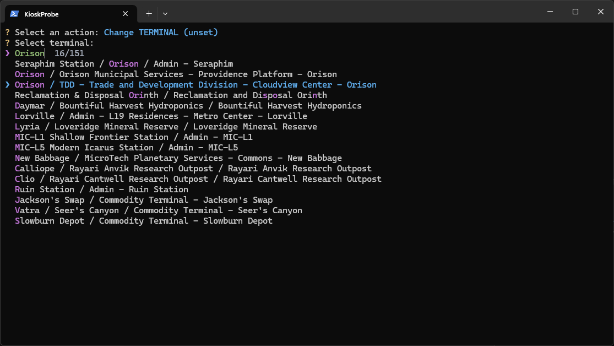
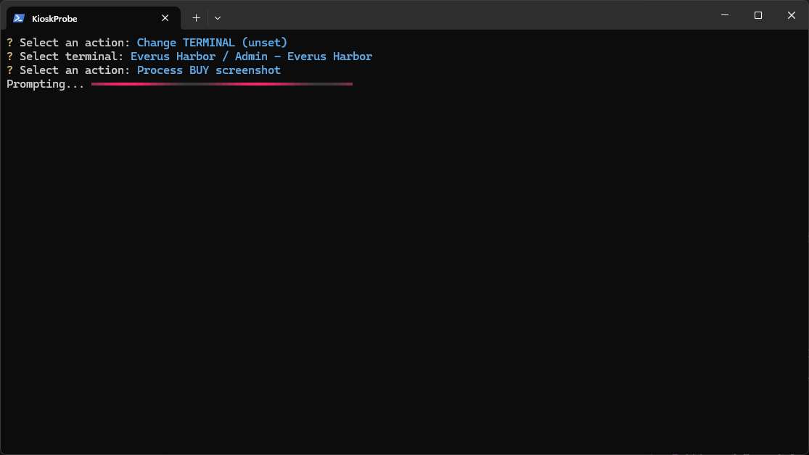
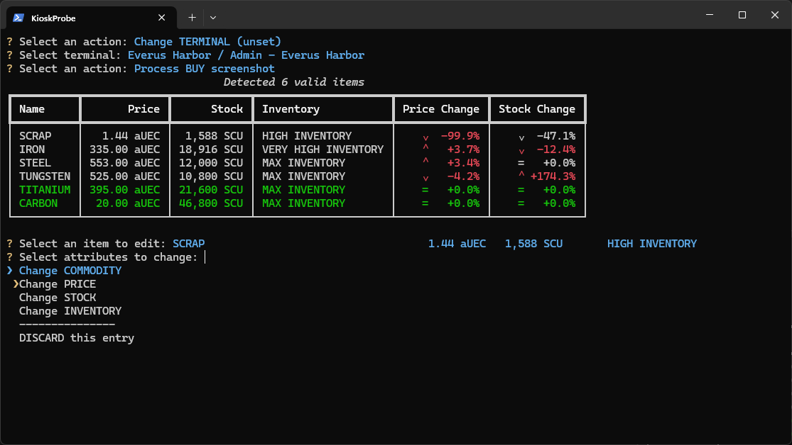

# Star Citizen Kiosk Probe

Hi!
Welcome to this tiny project of mine.
This solution aims to provide a simple (=automated, for the most part) way to extract commodity prices from appropriate terminals ([Admin](https://uexcorp.space/terminals/info/name/admin-everus-harbor/), [TDD](https://uexcorp.space/terminals/info/name/tdd-trade-and-development-division-area-18/)s, [Outpost](https://uexcorp.space/terminals/info/name/hickes-research-outpost/)s, ...) in the data-running services of [UEX Corp.](https://uexcorp.space/) in [Star Citizen's Persistent Universe](https://robertsspaceindustries.com/en/star-citizen).

[](https://uexcorp.space)

Unfortunately this solution requires the use of [OpenAI's API](https://platform.openai.com/) tools and hence is currently <span style="color: red">**not free**</span> to use.
Attempts were made to implement a local and free solution as well; however, this has proven to be pretty unreliable, especially between different in-game terminal designs (colours, fonts, noise, artefacts).
A single image prompt results in consumption of roughly 26k tokens.
With the [current pricing](https://platform.openai.com/docs/pricing) of USD 0.15/1M tokens for `gpt-4o-mini` that equals to a price tag of USD 0.0039 per image (about 256 prompts for a single dollar).
A complete mapping of a single terminal takes about 1-4 prompts (based on number of commodities bought/sold).


## Installation instructions

You need to have [Python](https://www.python.org/downloads/) installed in version at least `3.10` with [pip](https://packaging.python.org/en/latest/tutorials/installing-packages/#ensure-you-can-run-pip-from-the-command-line) for this project to work properly.
Order of the installation steps is important!

1. `python3 -m venv venv`
2. `source venv/bin/activate`
3. `pip install -r requirements.txt`

## Configuration
To be able to submit the data to UEX Corp servers, you will need to provide a valid API credentials.
Login to the [UEX Corp website](https://uexcorp.space/account) and copy your secret key to the `user_token` field in the `config/uex.json` file.
You can create `config/uex.json` by cloning the sample configuration:

```shell
cp config/uex.sample.json config/uex.json
```

Furthermore, OpenAI API key will be necessary.
You can generate one in the [organization admin dashboard](https://platform.openai.com/settings/organization/api-keys).
Paste your API key to the `api_key` field in the `config/openai.json` file.
This file can again be created by cloning the sample:

```shell
cp config/openai.sample.json config/openai.json
```

Model that will be used for data extraction can also be configured in the same config file (`model` field).
Default is `gpt-4o-mini` which is currently has the ideal ratio between affordability, speed and intelligence.
This can be changed to any other model which supports both `Image input` and `Responses API`.
These could be, for example:
- `gpt-4o` which usually has better accuracy but is almost 20x more expensive per input token,
- or `gpt-4.5-preview` which rarely does some mistakes but is currently 500x more expensive than `gpt-4o-mini`.

## Usage

Run the following commands in the project root directory to start the program:
1. `source venv/bin/activate`
2. `python3 main.py`

You can also use the convenience PowerShell script `./run.ps1` on Windows.
I recommend creating icon (`.Ink`) link to this script on your desktop for simple launch experience.
After the program has started, you can use the command line (CLI) to interact with it.
The CLI is a simple text-based interface that allows you to select actions to take and provide user input when necessary.

First select your current terminal.
Autocomplete is available, so the easiest place to start if you are not sure what the terminal name is exactly is to type in the planet/moon name.



The images for analysis are grabbed directly from clipboard.
Either copy an image to clipboard or take a screenshot using `prt sc` button and then select appropriate `Process` command.



After the screenshot has been processed the data are validated against last month min/max values.
This step allows manual item modifications to fix potential errors.
One such example can be seen in the picture below - `SCRAP` price has been identified incorrectly and the detected price is shown to differ by `-99.9` from the expected value.
This clearly indicates incorrect image processing.


| Select attributes to modify              | Modify values with validation                       |
|------------------------------------------|-----------------------------------------------------|
|  |  |

After processing a screenshot the process may be repeated to include commodities that were not previously visible.
This also allows processing commodities from two different tabs (buy/sell) in one upload.
Once you are happy with the tracked commodity collection and its values they can be _commited_ — sent to the UEX Corp. database.


After successfully commiting the data, you can immediately browse the created entries on the UEX Corp. website and/or continue with data-running.
